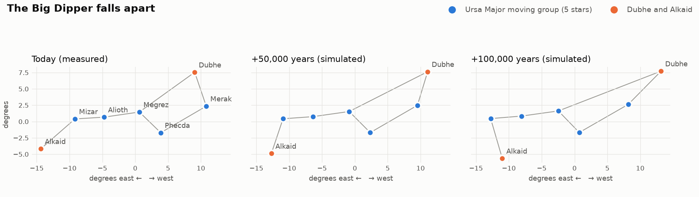

# Validation report

Generated by `python -m cosmos_time.build`. Every check runs on the decoded, quantised files in `time/data/` (bit-identical to what the browser integrates) with the reference integrator. Pass criteria were fixed in the plan before any data was fetched.

## Known-answer checks

| # | Check | Result | Criterion | Verdict |
|---|---|---|---|---|
| 1 | Sky at t = 0 vs Cosmos's 89 stars | 89/89 found; median offset 0.00389°, worst 7.29966° (LHS 1140) | all stars found; direction within 0.02° (distances reported, not gating) | **FAIL** |
| 2 | Barnard's Star | 3.7678 ly at +9,720 yr (11,736 CE) | 3.7–3.8 ly at +9,500–10,000 yr | **PASS** |
| 3 | Gliese 710 | 0.05155 pc (10,633 au) at +1.2934 Myr | 0.045–0.07 pc at +1.25–1.35 Myr | **PASS** |
| 4 | Big Dipper | members within 3.44 km/s; Dubhe 36.0, Alkaid 33.48 km/s away | members within 4.0 km/s of their mean, Dubhe & Alkaid ≥ 10.0 km/s away | **PASS** |
| 5 | Sun's orbit | 221.6 Myr (mean over 3 Gyr 226.6); ±113.2 pc every 88.0 Myr | one revolution in 220.0–240.0 Myr, crossing the plane (\|z\| > 20 pc both sides) | **PASS** |

### Why check 1 fails

All 89 stars are found and the median offset is 0.00389°, but 8 stars miss the 0.02° tolerance. For every one of them SIMBAD (an independent reference) agrees with this pipeline and disagrees with the coordinates hard-coded in `index.html`. These are errors in Cosmos's curated star table, not in the Gaia/Hipparcos data. The threshold was not relaxed; fixing them is a change to `index.html` and is left to the owner.

| Star | Ours vs Cosmos | Ours vs SIMBAD | Cosmos vs SIMBAD |
|---|---|---|---|
| LHS 1140 | 7.2997° | 0.00000° | 7.2997° |
| GJ 504 | 1.0001° | 0.00000° | 1.0001° |
| Wolf 1061 | 0.4730° | 0.00000° | 0.4730° |
| TOI-700 | 0.4193° | 0.00000° | 0.4193° |
| Kruger 60 | 0.1544° | 0.00000° | 0.1544° |
| Kepler-452 | 0.0690° | 0.00000° | 0.0690° |
| YZ Ceti | 0.0490° | 0.00001° | 0.0490° |
| Kepler-186 | 0.0203° | 0.00000° | 0.0203° |

Gliese 710 in straight-line motion would pass at 0.05117 pc at +1.2931 Myr; the Galactic tide moves it by 78 au. Published Gaia DR3 values span 0.052 pc (de la Fuente Marcos 2022) to 0.064 pc (Bailer-Jones 2022).

## Engineering checks

| Check | Result | Criterion | Verdict |
|---|---|---|---|
| Force table vs galpy | max relative error 5.5e-05 (2000 points) | < 1e-3 | **PASS** |
| Energy conservation, Sun | 1.8e-07 | \|ΔE/E\| < 1e-4 over ±250 Myr | **PASS** |
| dt = 0.1 vs 0.05 Myr at 250 Myr | Sun 0.042 pc, median star 0.020 pc | halving dt moves the Sun < 1 pc and the median star < 10 pc at 250 Myr | **PASS** |
| Integrated vs straight line | 0.1 Myr: 4.0e-04 of the motion; 1 Myr: 0.19 pc; 5 Myr: 4.8 pc (≈0.57× the tidal estimate at every span) | at 0.1 Myr, integrated vs straight-line differ by < 0.1% of the distance moved | **PASS** |
| Reversibility (float64) | 1.6e-10 pc | float64 out-and-back over 250 Myr returns within 1e-6 pc | **PASS** |

Browser-side tests (`time/test/`): the JS float64 twin and the WebGPU float32 kernel are compared against fixtures from this integrator, and a deep-link determinism test checks that the settled state is bit-identical however the time was reached.

## Data

* 1,007,124 stars: 801,757 nearest-first Gaia DR3, 200,062 disk sample, 5,305 bright/named (4,426 of them from Hipparcos-2 + XHIP).
* 59 stars have no radial velocity anywhere and are integrated with RV = 0 (flagged).
* 8,067 stars stored at full float32 precision; 1,070 tracked for labels and figures.
* Files: 59.3 MB in total; 16.2 MB of star data load up front.
* Solar parameters (astropy `Galactocentric` v4.0): R0 = 8.122 kpc, z☉ = 20.8 pc, v☉ = (12.9, 245.6, 7.78) km/s.
